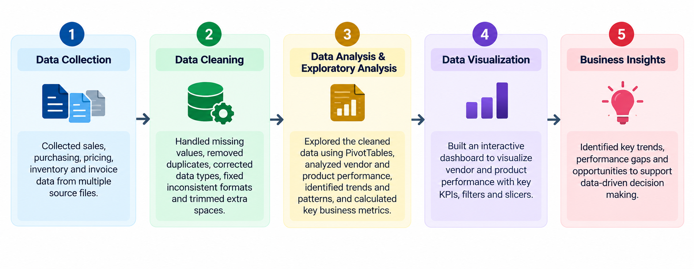

# Vendor Performance Analytics

## Problem Statement

Businesses working with multiple vendors often have sales, purchasing, pricing, inventory, and invoice data spread across different datasets. This makes it difficult to get a clear and consolidated view of vendor performance.

Without a structured analysis, it becomes challenging to identify which vendors and products are contributing strongly to sales and profitability, where performance is weak, and which areas require attention.

## Objective

- Evaluate vendor and product performance using key business metrics.
- Identify high-performing and underperforming vendors.
- Compare sales and purchasing performance across vendors.
- Analyze pricing, costs, inventory, and profitability patterns.
- Identify performance gaps and areas that require attention.
- Provide actionable insights to support vendor management and business decisions.

## Project Workflow

**Data Collection → Data Cleaning → Data Analysis & Exploratory Analysis → Data Visualization → Business Insights**

## Approach

### 1. Data Collection

Collected and consolidated the available data related to:

- Vendors
- Products
- Purchases
- Sales
- Pricing
- Inventory
- Invoices

### 2. Data Cleaning

Prepared the data for analysis by:

- Checking data quality and consistency
- Handling missing values
- Removing duplicate records where required
- Correcting data types
- Standardizing inconsistent formats
- Removing unnecessary spaces and inconsistencies

### 3. Data Analysis & Exploratory Analysis

Explored the cleaned data to understand vendor and product performance and identify meaningful patterns across:

- Sales
- Purchasing
- Costs
- Pricing
- Inventory
- Profitability

Key business metrics were calculated and analyzed to compare vendor and product performance.

### 4. Data Visualization

Built an interactive dashboard to visualize vendor and product performance using relevant KPIs, filters, and slicers.

The dashboard enables users to compare vendors and products and identify performance differences efficiently.

### 5. Business Insights

Interpreted the analysis to identify important performance differences between vendors and products and highlight areas requiring business attention.

## Solution

The analysis provides a consolidated view of vendor and product performance, enabling the business to evaluate vendor effectiveness and identify areas for improvement.

The solution enables the business to:

- Compare vendors based on **sales contribution, purchase value, gross profit, profit margin, and quantity sold**.
- Identify **high-performing vendors** that contribute strongly to sales and profitability.
- Identify **underperforming vendors** where sales contribution or profitability is relatively low.
- Compare **product performance across vendors** to understand which products drive business performance.
- Examine the relationship between **purchase cost, selling price, sales, and gross profit** to identify cost and margin differences.
- Evaluate **inventory levels against sales performance** to identify areas where inventory may require attention.
- Compare vendor performance using consistent metrics rather than reviewing vendors individually from separate datasets.
- Use the interactive dashboard to filter and compare vendors and products and quickly identify performance gaps.

The final solution transforms vendor, sales, purchasing, pricing, inventory, and invoice data into a **single performance view that supports better vendor evaluation, purchasing decisions, cost management, and business planning**.

## Dashboard

